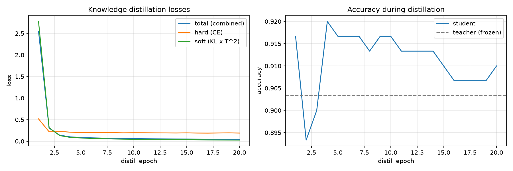

# Knowledge Distillation Demo

End-to-end knowledge distillation demo with a mock teacher (large MLP) and student (small MLP) on a synthetic 2D 3-class dataset.

## Run

```bash
uv sync
uv run python train_kd.py
```

## Result


