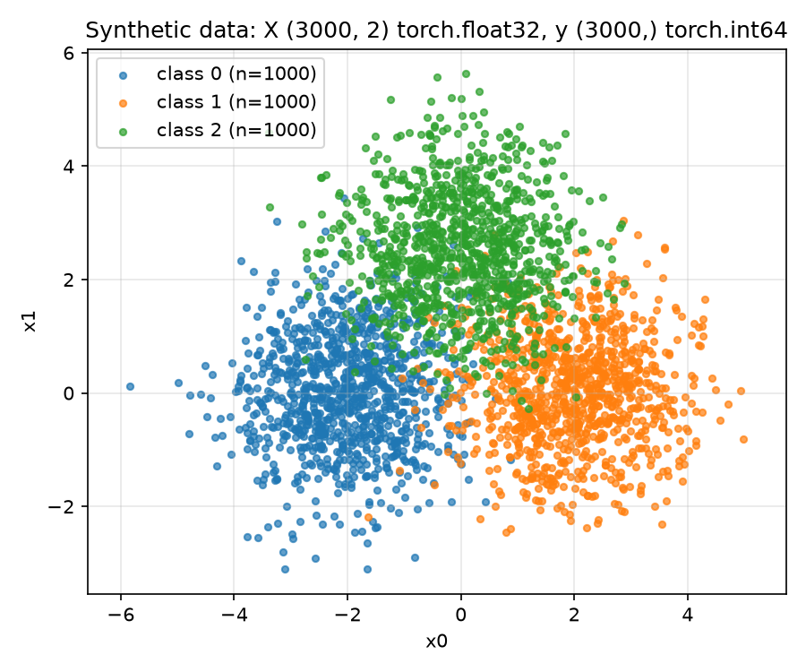

# Knowledge Distillation

End-to-end knowledge distillation demo with a mock teacher (large MLP) and student (small MLP) on a synthetic 2D 3-class dataset.

## Method (Hinton et al., 2015)

`train_knowledge_distillation()` in `train_kd.py` follows Section 2 of *Distilling the Knowledge in a Neural Network*, with the paper's notation (`v`: teacher logits, `z`: student logits):

- Soft loss: `T^2 * C` where `C = -sum(p * log q)`, `p = softmax(v / T)`, `q = softmax(z / T)` (Eq. 1). Teacher is frozen and both use `T = 3.0`. The `T^2` factor compensates for the `1/T^2` shrinking of soft-target gradients (Eqs. 2–4).
- Hard loss: standard cross-entropy of `z` at `T = 1` against true labels.
- Combined loss: `(1 - alpha) * soft + alpha * hard` with `alpha = 0.1`.

## Run

```bash
$ uv sync
$ uv run python train_kd.py
```

## Data

`make_synthetic_data()` generates 3 Gaussian blobs in 2D, one per class:

- `X`: `(3000, 2)`, `torch.float32` — 2D coordinates, centers at `[-2, 0]`, `[2, 0]`, `[0, 2.5]` with std 1.
- `y`: `(3000,)`, `torch.int64` — class labels 0/1/2, 1000 samples each.



## Result


## Reference

- Geoffrey Hinton, Oriol Vinyals, Jeff Dean. *Distilling the Knowledge in a Neural Network.* arXiv:1503.02531, 2015. [arXiv](https://arxiv.org/abs/1503.02531)
